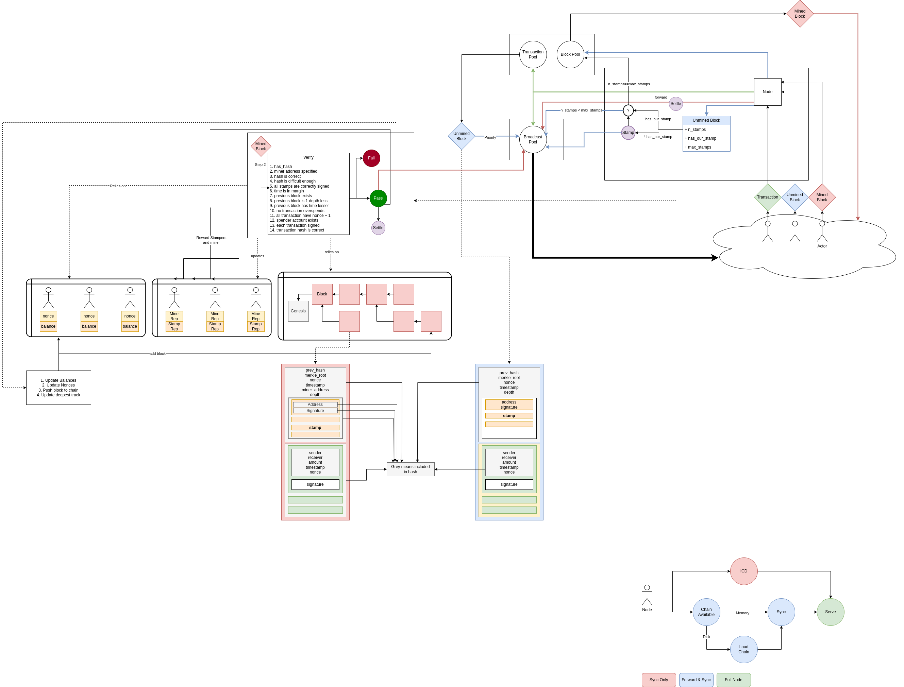

# Project

Zero-trust decentralized ledger written in Rust.

Vision:
- A two tier network where:
    - The main network handles transaction through proof of work consensus
    - A second tier of the network is a rank system for external submition for arbitrary work to be done on a specific level of trust.
- Incentive does not come through transaction fees, but rather through ranking up trust in order to be employed by paying third parties for computations

Currently in heavy development.

The flow can be rougly seen in the following image.

